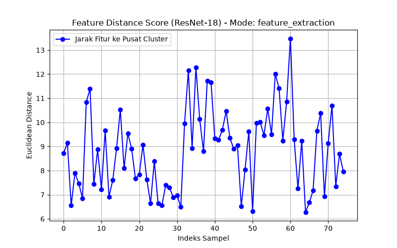
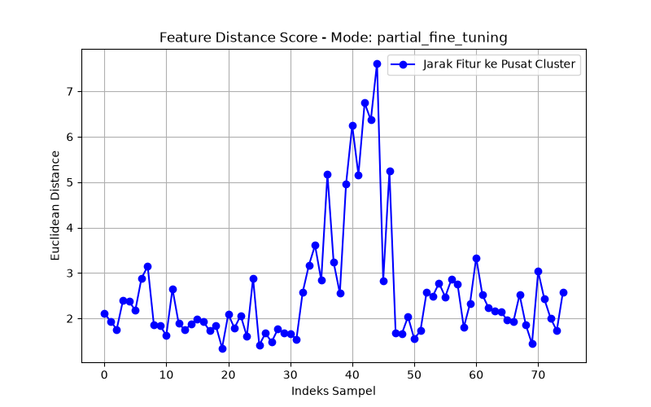
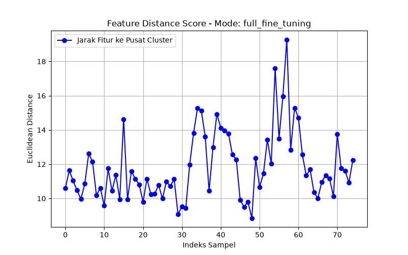

# Practical Work Transfer Learning Using Premodel ResNet-18


Proyek ini dikembangkan untuk mendeteksi manekin korban pada kontes **Kontes Robot Search and Rescue Indonesia (KRSRI)**. Karena dataset yang tersedia merupakan dataset kelas tunggal (*single-class dataset*), strategi yang digunakan disesuaikan menjadi **One-Class Anomaly Detection** menggunakan arsitektur **ResNet-18** sebagai *feature extractor* dan **One-Class SVM** untuk pemodelan batas distribusi visual target.

---

## 🛠️ Tech Stack & Dependencies
* **Python**: 3.11
* **Framework Deep Learning**: TensorFlow / Keras
* **Pretrained Model**: ResNet-18 via `image-classifiers` / `classification-models-keras`
* **Machine Learning**: Scikit-Learn (One-Class SVM)
* **Pengolahan Citra & Data**: Pillow (PIL), NumPy, Pandas
* **Visualisasi**: Matplotlib

---

## 📐 Metodologi Eksperimen
Eksperimen dilakukan untuk mengevaluasi dampak tingkat pembekuan layer (*layer freezing depth*) pada *backbone* ResNet-18 terhadap kualitas representasi fitur dan latensi inferensi. Eksperimen dibagi menjadi 3 mode:

1. **Feature Extraction**: Seluruh *backbone* ResNet-18 dibekukan (*frozen*).
2. **Partial Fine-Tuning**: 5 layer teratas pada ResNet-18 dibuka kunciannya (*unfrozen*).
3. **Full Fine-Tuning**: Seluruh layer pada ResNet-18 dibuka kunciannya untuk inferensi fitur.

---

## 📊 Hasil Eksperimen

### Ringkasan Performansi (`results_summary.csv`)
Tabel ringkasan hasil kalkulasi jarak fitur rata-rata dan latensi inferensi per frame dapat dilihat pada file `results_summary.csv`.

---

## 📈 Visualisasi Jarak Fitur (Feature Distance Plots)

| Feature Extraction | Partial Fine-Tuning | Full Fine-Tuning |
| :---: | :---: | :---: |
|  |  |  |

---

## 🚀 Cara Menjalankan Proyek

1. **Clone Repositori**
   ```bash
   git clone [https://github.com/mrasyiidp/computer-vision-and-deep-learning.git](https://github.com/mrasyiidp/computer-vision-and-deep-learning.git)
   cd computer-vision-and-deep-learning
